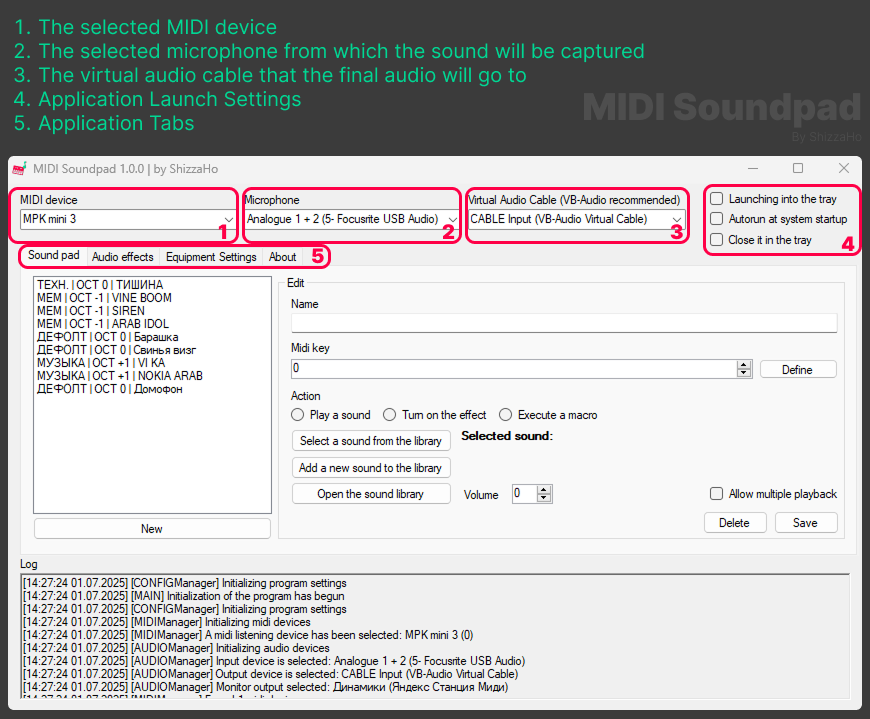
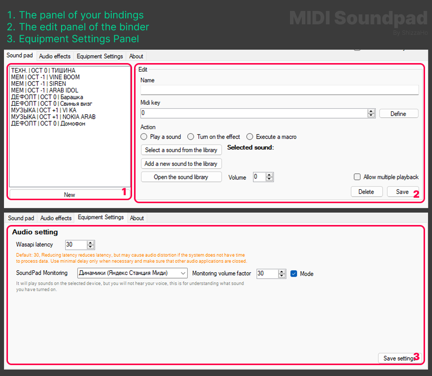

[Russian readme](/README_RU.md)

# MIDI Soundpad

A simple and convenient tool for playing sounds using a MIDI keyboard. 

Your MIDI keyboard is capable not only of making sounds in musical programs, but also of creating funny situations with your friends and not only :D

## Getting started

The installation is very simple, download the current release and unpack it to a convenient location.
After unpacking, run `MidiSoundpad.exe` by pre-connecting your `MIDI device` 

If you have done everything correctly, you will see the application interface where you need to select your `MIDI device`, `microphone` and `virtual audio cable`.

After that, set the input source as your `virtual audio cable` in the applications you need.

From now on, you can start using the soundpad and add your own sounds by assigning `MIDI signals` to them

## Interface Instructions

## Known problems and methods of their solution

## For developers

The application was made for itself, because the code is not documented and is somehow "skewed". The main thing that works :D

If the community suddenly becomes interested (or I'm not too lazy), I'll conduct a massive code refactor and improve it as soon as I can (I'll also document it in full)

You can freely use the source code and so on for your own purposes, the main thing is to indicate my authorship

## Support the author

[DonationAlert](https://www.donationalerts.com/r/shizzaho)

Thincoin

