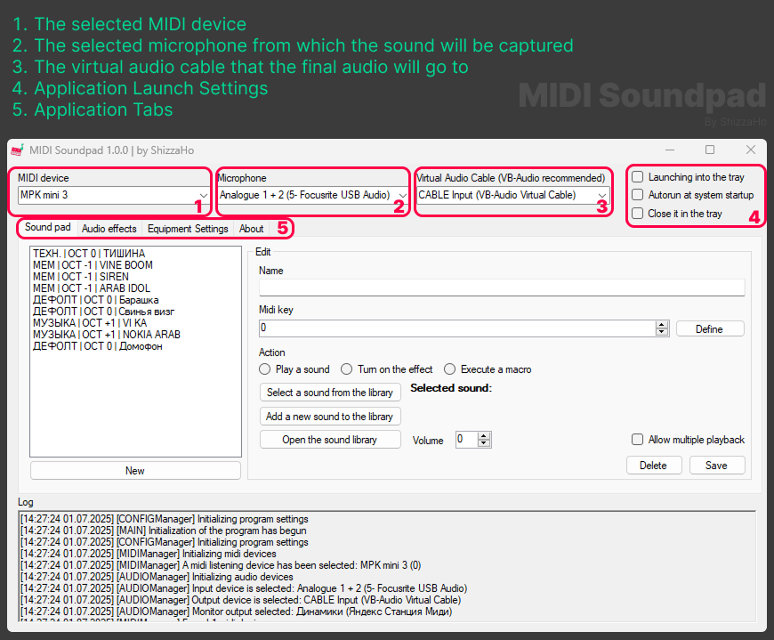

[English readme](/README.md)

# MIDI Soundpad

Простой и удобный инструмент для воспроизведения звуков с помощью MIDI-клавиатуры. 

Ваша MIDI-клавиатура способна не только издавать звуки в музщыкальных программах, но еще и создавать смешные ситуации с вашими друзьями и не только :D

## Зависимости для запуска

[.NET Framework 4.7.2 и выше](https://dotnet.microsoft.com/download)

## Начало работы

Установка очень простая, скачайте актуальный релиз и распакуйте в удобное вам место.
После распаковки запустите `MidiSoundpad.exe` предварительно подключив ваше `MIDI устройство` 

Если вы сделали все правильно то у вас откроется интерфейс приложения в котором вам необходимо выбрать ваше `MIDI-устройство`, `микрофон` и `виртуальный аудиокабель`

После этого поставьте в нужных вам приложениях источник ввода как ваш `виртуальный аудиокабель`

С этого момента вы уже можете начать использовать саундпад и добавлять свои звуки назначая на них `MIDI-сигналы`

## Инструкция по интерфейсу

## Известные проблемы и методы их решения

## Для разработчиков

Приложение делалось для себя, потому код не документирован и сделан в каком-то роде "на перекосяк". Главное что работает :D

Если вдруг сообществу станет интересно (либо мне будет не лень), я проведу массовый рефактор кода и улучшу его как только умею (еще и документирую его по полной)

Можете свободно использовать исходный код и тд в своих целях, главное укажите мое авторство

## Поддержать автора

[DonationAlert](https://www.donationalerts.com/r/shizzaho)

Тонкоин

